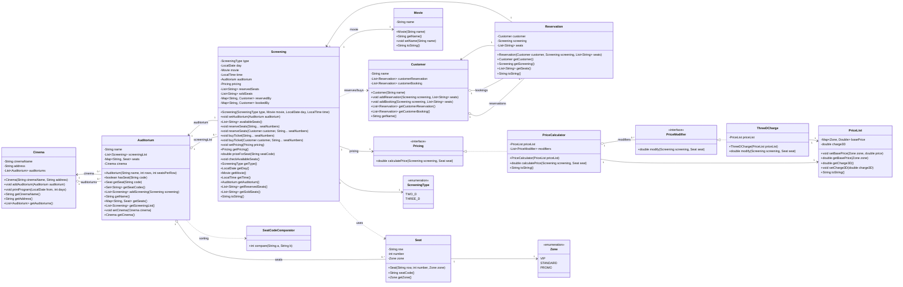

Diagram klas

```mermaid
classDiagram
direction LR

%% =======================
%% cinema
%% =======================
class Cinema {
  -String cinemaName
  -String address
  -List~Auditorium~ auditoriums
  +Cinema(String cinemaName, String address)
  +void addAuditorium(Auditorium auditorium)
  +void printProgram(LocalDate from, int days)
  +String getCinemaName()
  +String getAddress()
  +List~Auditorium~ getAuditoriums()
}

class Auditorium {
  -String name
  -List~Screening~ screeningList
  -Map~String, Seat~ seats
  -Cinema cinema
  +Auditorium(String name, int rows, int seatsPerRow)
  +boolean hasSeat(String code)
  +Seat getSeat(String code)
  +Set~String~ getSeatCodes()
  +List~Screening~ addScreening(Screening screening)
  +String getName()
  +Map~String, Seat~ getSeats()
  +List~Screening~ getScreeningList()
  +void setCinema(Cinema cinema)
  +Cinema getCinema()
}

class Seat {
  -String row
  -int number
  -Zone zone
  +Seat(String row, int number, Zone zone)
  +String seatCode()
  +Zone getZone()
}

class Movie {
  -String name
  +Movie(String name)
  +String getName()
  +void setName(String name)
  +String toString()
}

class Screening {
  -ScreeningType type
  -LocalDate day
  -Movie movie
  -LocalTime time
  -Auditorium auditorium
  -Pricing pricing
  -List~String~ reservedSeats
  -List~String~ soldSeats
  -Map~String, Customer~ reservedBy
  -Map~String, Customer~ bookedBy
  +Screening(ScreeningType type, Movie movie, LocalDate day, LocalTime time)
  +void setAuditorium(Auditorium auditorium)
  +List~String~ availableSeats()
  +void reserveSeats(String... seatNumbers)
  +void reserveSeats(Customer customer, String... seatNumbers)
  +void buyTicket(String... seatNumbers)
  +void buyTicket(Customer customer, String... seatNumbers)
  +void setPricing(Pricing pricing)
  +Pricing getPricing()
  +double priceForSeat(String seatCode)
  +void checkAvailableSeats()
  +ScreeningType getType()
  +LocalDate getDay()
  +Movie getMovie()
  +LocalTime getTime()
  +Auditorium getAuditorium()
  +List~String~ getReservedSeats()
  +List~String~ getSoldSeats()
  +String toString()
}

%% =======================
%% reservation
%% =======================
class Customer {
  -String name
  -List~Reservation~ customerReservation
  -List~Reservation~ customerBooking
  +Customer(String name)
  +void addReservation(Screening screening, List~String~ seats)
  +void addBooking(Screening screening, List~String~ seats)
  +List~Reservation~ getCustomerReservation()
  +List~Reservation~ getCustomerBooking()
  +String getName()
}

class Reservation {
  -Customer customer
  -Screening screening
  -List~String~ seats
  +Reservation(Customer customer, Screening screening, List~String~ seats)
  +Customer getCustomer()
  +Screening getScreening()
  +List~String~ getSeats()
  +String toString()
}

%% =======================
%% tickets
%% =======================
class Pricing {
  <<interface>>
  +double calculatePrice(Screening screening, Seat seat)
}

class PriceModifier {
  <<interface>>
  +double modify(Screening screening, Seat seat)
}

class PriceList {
  -Map~Zone, Double~ basePrice
  -double charge3D
  +void setBasePrice(Zone zone, double price)
  +double getBasePrice(Zone zone)
  +double getCharge3D()
  +void setCharge3D(double charge3D)
  +String toString()
}

class PriceCalculator {
  -PriceList priceList
  -List~PriceModifier~ modifiers
  +PriceCalculator(PriceList priceList)
  +double calculatePrice(Screening screening, Seat seat)
  +String toString()
}

class ThreeDCharge {
  -PriceList priceList
  +ThreeDCharge(PriceList priceList)
  +double modify(Screening screening, Seat seat)
}

%% =======================
%% set
%% =======================
class Zone {
  <<enumeration>>
  VIP
  STANDARD
  PROMO
}

class ScreeningType {
  <<enumeration>>
  TWO_D
  THREE_D
}

class SeatCodeComparator {
  +int compare(String a, String b)
}

%% =======================
%% Relationships
%% =======================
Cinema "1" o-- "0..*" Auditorium : auditoriums
Auditorium "1" o-- "0..*" Seat : seats
Auditorium "1" o-- "0..*" Screening : screeningList
Auditorium "0..*" --> "1" Cinema : cinema

Screening "1" --> "1" Movie : movie
Screening "1" --> "1" Auditorium : auditorium
Screening "1" --> "1" Pricing : pricing
Screening ..> Seat : uses
Screening ..> Customer : reserves/buys

Customer "1" o-- "0..*" Reservation : reservations
Customer "1" o-- "0..*" Reservation : bookings
Reservation "1" --> "1" Customer
Reservation "1" --> "1" Screening

Pricing <|.. PriceCalculator
PriceModifier <|.. ThreeDCharge
PriceCalculator "1" --> "1" PriceList
PriceCalculator "1" o-- "0..*" PriceModifier : modifiers
ThreeDCharge "1" --> "1" PriceList

Seat "1" --> "1" Zone
Screening "1" --> "1" ScreeningType

Auditorium ..> SeatCodeComparator : sorting
```